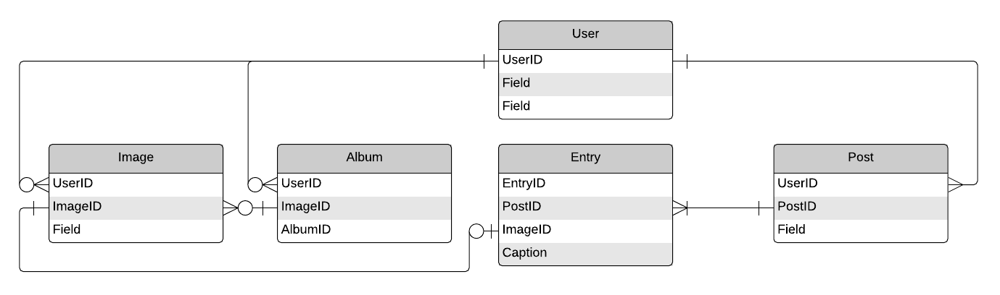

# General Assembly SEI Project 4: ImageBored


## Introduction
An image sharing social network site inspired by imgur.com and instagram. Users can create accounts, upload images then make posts that consist of images and captions. The front end was made using React, while the back end was made using Python and Flask. I also used external APIs to initially populate the site with users and stock images.

## Timeframe
1 week (July 2019)

## Technologies Used
- React
- Python
- Flask
- PostgreSQL
- SQLAlchemy
- Marshmallow
- Randomuser.me and Pixabay APIs

## Approach
I first started with planning out the back end. I created an ERD to visualise the database schema.



After creating the models and the relationships between them using SQLAlchemy and Marshmallow, I then created the controllers using Flask so that I could interact with my database from my front end.

```python
from models.image import Image, ImageSchema

@api.route('/images/<int:image_id>', methods=['GET'])
def show(image_id):
    image = Image.query.get(image_id)
    if not image:
        return {'message': 'Image not found'}, 404
    return image_schema.jsonify(image), 200
```

For example, when a GET request is made to the url '/images/123' this 'show' function runs, which queries the 'Image' table in the database for records that have the id '123'. If a record with that id is not found, an error message is returned to the user, otherwise a JSON object containing the fields and values of that image record is returned.

After completing the back end I started on the front end. When displaying data from, or otherwise interacting with the database, the front end would make a http request to the back end.

```javascript
axios.get('/api/posts')
  .then(res => this.setState({ posts: res.data, totalHeight }))
  .catch(err => console.log(err))
```  
Here a GET request is being made to retrieve all Posts in the database and the results are being saved in the React state object, so they can later be displayed on the page. 

## Screenshots


## Wins
In the seeds file I was able to initially populate the site with 75 users and 200 images using external APIs.

```javascript
// get random users from randomuser.me
response = requests.get(
    'https://randomuser.me/api/',
    params={
        'results': 75,
        'nat': 'gb',
        'inc': 'name,email,login,picture',
        'noinfo': True
})
api_users = response.json()['results']

// get images from pixabay
response = requests.get(
    'https://pixabay.com/api/',
    params={
        'key': pixabay_api_key,
        'editors_choice': True,
        'page': 1,
        'per_page': 200
    }
)
api_images = response.json()['hits']

// get images from pixabay
response = requests.get(
    'https://pixabay.com/api/',
    params={
        'key': pixabay_api_key,
        'editors_choice': True,
        'page': 2,
        'per_page': 200
    }
)
api_images = api_images + response.json()['hits']
```

By inserting the JSON objects return from the API requests into valid User and Post models, I was able to fully populate the site without having to manually register users and create posts.

I also learned a lot about Flask and SQLAlchemy while creating the complex relationships between my models. One feature I added was allowing users to login by typing their email or username within the same input field.

```python
@api.route('/login', methods=['POST'])
def login():
    # check data is valid JSON object
    try:
        data = request.get_json()
    except:
        return {'message': 'That is not a valid JSON Object'}, 422
    # if post request does not include username or password fields return error
    for field in ('username', 'password'):
        if not field in data:
            required_field = 'Username or Email' if field == 'username' else 'Password'
            return {'message': f'{required_field} is required'}, 411
    # query by username column, if no user found then query by email column
    user = User.query.filter((User.username == data['username']) | (User.email == data['username'])).first()
    # if no user found or if password is incorrect return error
    if not user or not user.validate_password(data['password']):
        return {'message': 'Unauthorized'}, 401
    return {'message': f'Welcome Back {user.username}', 'token': user.generate_token()}, 202
```

While for a large database, searching all usernames then all emails for a match would be suboptimal, for a smaller database like mine the difference made is negligible. If I were to improve this, I would check if the String contained an '@'. I've validated my user schema to only contain letters and numbers, so if an '@' were present then I would only search the email field. And conversely if an '@' were not present, I would know to search only the username field in my database.


## Challenges
Building the back end proved to be challenging here. I overcame this by studying the documentation for Flask, SQLAlchemy and Marshmallow to create the relationships and schemas that I needed. This left me with less time for the front end, which meant the site is not fully functional. I have left this project on GitHub for posterity, but have since remade this project

## Future Features
Due to the unexpected complexity of the back end I didn't get time to finish the front end. While users can register, browse posts and browse users they cannot create posts or upload images. To continue this I would add a create post page so new users could add new content.
